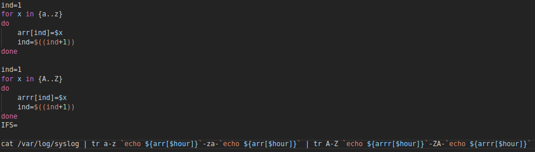

# SoalShift_modul1_A15

1. Anda diminta tolong oleh teman anda untuk mengembalikan filenya yang telah
dienkripsi oleh seseorang menggunakan bash script, file yang dimaksud adalah
nature.zip. Karena terlalu mudah kalian memberikan syarat akan membuka seluruh
file tersebut jika pukul 14:14 pada tanggal 14 Februari atau hari tersebut adalah hari
jumat pada bulan Februari.
-----------------------------------

Untuk menjawabnya pertama – tama yang diperlukan adalah extract nature.zip terlebih dahulu

Lakukan perulangan untuk setiap file yang ada di dalam folder nature yang sudah di extract

Untuk setiap file akan di tampung di variabel i, nantinya file akan di decode dengan base64 terlebih dahulu

Kemudian hasilnya akan di decode reverse dengan hexdump

Hasil file yang telah terencrypt akan disimpan pada folder nature dengan format hasil[urutan].jpg

File sebelum di encrypt di hapus

Untuk mengatur cron agar sesuai dengan perintah maka diatur seperti dibawah ini :

- - - -

2. Anda merupakan pegawai magang pada sebuah perusahaan retail, dan anda diminta
untuk memberikan laporan berdasarkan file WA_Sales_Products_2012-14.csv.
Laporan yang diminta berupa:
-----------------------------------

a. Tentukan negara dengan penjualan(quantity) terbanyak pada tahun 2012.

b. Tentukan tiga product line yang memberikan penjualan(quantity) terbanyak pada soal poin a.

c. Tentukan tiga product yang memberikan penjualan(quantity) terbanyak berdasarkan tiga product line yang didapatkan pada soal poin b.

- - - -

Untuk penyelesaiannya digunakan awk, pada saat menggunakan awk untuk membaca file .csv, digunakan option FS="," pada bagian BEGIN, untuk menunjukkan bahwa input pada tiap baris dipisahkan oleh tanda ",".

a. dibuat map dengan index nama negara, berisi jumlah total penjualan

kemudian pada bagian END dilakukan looping untuk menemukan negara dengan penjualan terbanyak

output dari soal a disimpan ke dalam variabel country

b. menambahkan nama negara hasil dari soal a dengan option -v var="$country" pada command awk

membuat map seprti soal a, dengan index nama product line khusus untuk negara yang didapatkan pada soal a

kemudian pada bagian END outputkan jumlah penjualan dan nama product line, dan di pipe dengan command sort agar terurut, dan disimpan dalam file temporary 2.txt

dengan looping shell dan awk sederhana tiga productline teratas di masukkan ke dalam array pline

c. membuat map dengan index nama product dari 3 product line hasil soal b

setelah diprint pada bagian END, di-pipe ke command sort, dan diprint tiga product teratas dengan awk

- - - -

3. Buatlah sebuah script bash yang dapat menghasilkan password secara acak
sebanyak 12 karakter yang terdapat huruf besar, huruf kecil, dan angka. Password
acak tersebut disimpan pada file berekstensi .txt dengan ketentuan pemberian nama
sebagai berikut:
---------------------------

a. Jika tidak ditemukan file password1.txt maka password acak tersebut disimpan pada file bernama password1.txt

b. Jika file password1.txt sudah ada maka password acak baru akan disimpan pada file bernama password2.txt dan begitu seterusnya.

c. Urutan nama file tidak boleh ada yang terlewatkan meski filenya dihapus.

d. Password yang dihasilkan tidak boleh sama.

- - - -

Pertama tama yang dilakukan adalah menentukan nama file yang akan dibuat dan disimpan dalam variabel n4 

Setelah mendapat nama filenya kita perlu menggenerate passwordnya yang dilakukan dengan cara membuat sebuah array yang berisi digit, lowercase, dan uppercase

Dari array yang telah dibuat kita akan melakukan iterasi sebanyak 12 kali untuk memilih elemen randam yang terdapat dalam array

Setelah menggenerate password perlu dilakukan cek apakah password memiliki ketiga elemen yang telah ditentukan
1. Cek digit dalam password

2. Cek lowercase dalam password

3. Cek uppercase dalam password

Setelah password sesuai, password akan disimpan dalam file

- - - -

4. Lakukan backup file syslog setiap jam dengan format nama file “jam:menit tanggal-
bulan-tahun”. Isi dari file backup terenkripsi dengan konversi huruf (string
manipulation) yang disesuaikan dengan jam dilakukannya backup misalkan sebagai
berikut:
--------------------------

a. Huruf b adalah alfabet kedua, sedangkan saat ini waktu menunjukkan
pukul 12, sehingga huruf b diganti dengan huruf alfabet yang memiliki
urutan ke 12+2 = 14.

b. Hasilnya huruf b menjadi huruf n karena huruf n adalah huruf ke
empat belas, dan seterusnya.

c. setelah huruf z akan kembali ke huruf a

d. Backup file syslog setiap jam.

e. dan buatkan juga bash script untuk dekripsinya.

- - - -

untuk nama file, digunakan command date dengan format yang diinginkan

untuk menentukan jam sekarang, digunakan command date

enkripsi dilakukan dengan command tr dengan argument kedua merupakan hasil translasi huruf menggunakan array huruf

karena nama file mengandung karakter " " (spasi), variabel IFS (Internal Field Separator) harus didefinisikan sebagai newline

untuk dekripsi jam sebagai decrypt-key didapatkan dari nama file

untuk dekripsinya cukup membalik argumen pada tr di kode enkripsinya

script enkripsi dijalankan tiap jam dengan crontab @hourly atau 0 * * * * *

- - - -

5. Buatlah sebuah script bash untuk menyimpan record dalam syslog yang memenuhi
kriteria berikut:
---------------------------

a. Tidak mengandung string “sudo”, tetapi mengandung string “cron”,
serta buatlah pencarian stringnya tidak bersifat case sensitive,
sehingga huruf kapital atau tidak, tidak menjadi masalah.

b. Jumlah field (number of field) pada baris tersebut berjumlah kurang
dari 13.

c. Masukkan record tadi ke dalam file logs yang berada pada direktori
/home/[user]/modul1.

d. Jalankan script tadi setiap 6 menit dari menit ke 2 hingga 30, contoh
13:02, 13:08, 13:14, dst.

- - - -

Untuk mengerjakannya kita dapat menggunakan fungsi awk
a. Untuk mencari log yang tidak mengandu “sudo” tetapi mengandung “cron” ditambahkan option

b. Untuk log yang jumlah fielldnya kurang dari 13 tambahkan 

c. Kemudian record akan disimpan ke direktori /home/[user]/modul1

Sehingga hasil keseluruhan bash script adalah

d. Untuk mengatur cron agar sesuai dengan perintah maka diatur seperti dibawah ini :

- - - -